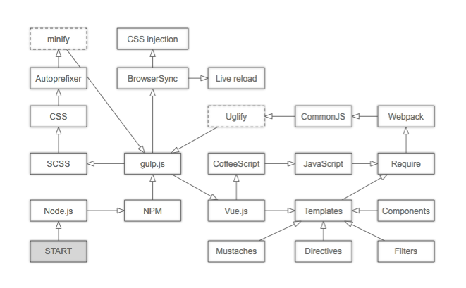

# Development

## Core developers

- Robin Andeer (RA)
- Måns Magnusson (MM)
- Henrik Stranneheim (HS)
- Mats Dahlberg (MD)


## Flask structure
Blueprints separate as much logic as possible from the central Flask server. This includes views, templates, and static assets but not yet Flask extensions.


## Fixtures data
The default fixtures adapter is implemented in ``chanjo.ext.backend.FixtureAdapter``. If you are writing a new adapter, please look at the implementation of the ``FixtureAdapter`` and ``BaseAdapter`` to follow the defined API style.


## Frontend
Node.js compiles frontend assets such as [SCSS](http://sass-lang.com/) modules and [Vue.js](http://vuejs.org/) components. It's also responsible for auto-reloading the browser when updates are made to the files. All this functionality is centralized to [gulp.js](http://gulpjs.com/). An overview of how all components of this system are connected is visualized below:



To start watching files and compile and reload automatically run:

```bash
$ gulp
```

All assets are already bundled but before deployment one should compile the files for production (Uglify + minify). This is accomplished as such:

```bash
$ gulp build --production
```

## FAQ

### Unable to install PyOpenSSL/Cryptography
Quite a few people seem to have problems installing later versions on PyOpenSSL. This in mainly because of the Cryptography dependency that was introduces post 0.13 so it's possible you will find more luck installing it as:

```bash
$ pip install PyOpenSSL==0.13
```
